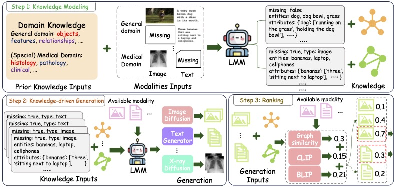

# Knowledge-Bridger

Official repository for the paper "[Knowledge Bridger: Towards Training-Free Missing Modality Completion](https://arxiv.org/pdf/2502.19834)".

[[📖 Paper](https://arxiv.org/pdf/2502.19834)]

- This paper is accepted at **CVPR 2025** 🎉.


## TLDR;

We explore the potential of leveraging large multimodal models to generate missing modalities. In scenarios with limited computing resources (such as scarce data and GPUs), fine-tuning an end-to-end model becomes challenging. To address this, we aim to harness large models to extract cross-modal knowledge, which in turn guides pretrained generative models in producing the desired missing data. Unlike traditional generative paradigms, our approach first derives a refined prompt based on the extracted knowledge. This new prompt then directs the generative model to synthesize the missing data. Finally, we employ ranking tools to identify the most plausible missing data by evaluating semantic similarity and knowledge graph similarity between the generated modality and the available modalities.


## Abstract

Previous successful approaches to missing modality completion rely on carefully designed fusion techniques and extensive pre-training on complete data, which can limit their generalizability in out-of-domain (OOD) scenarios. In this study, we pose a new challenge: **can we develop a missing modality completion model that is both resource-efficient and robust to OOD generalization?** To address this, we present a training-free framework for missing modality completion that leverages large multimodal model (LMM). Our approach, termed the ``Knowledge Bridger'', is modality-agnostic and integrates generation and ranking of missing modalities. By defining domain-specific priors, our method automatically extracts structured information from available modalities to construct knowledge graphs. These extracted graphs connect the missing modality generation and ranking modules through the LMM, resulting in high-quality imputations of missing modalities. Experimental results across both general and medical domains show that our approach consistently outperforms competing methods, including in OOD generalization. Additionally, our knowledge-driven generation and ranking techniques demonstrate superiority over variants that directly employ LMMs for generation and ranking, offering insights that may be valuable for applications in other domains.

The workflow of this work.

<p align="center">
     <br>
</p>


## Get Started

### Installation

1. Basic ENV.

This project is based on Python 3.11 and Transformers 4.46.1.

```
conda create --name kb --file requirements.txt
conda activate kb
```

2. Install Vllm.

```
pip install vllm
```

3. Download the Large models.

- For Qwen-2-VL series:
```
huggingface-cli download Qwen/Qwen2-VL-2B-Instruct 
huggingface-cli download Qwen/Qwen2-VL-7B-Instruct 
huggingface-cli download Qwen/Qwen2-VL-72B-Instruct-GPTQ-Int8 
```

- For stable diffusion XL:
```
huggingface-cli download stabilityai/stable-diffusion-xl-base-1.0
huggingface-cli download stabilityai/stable-diffusion-xl-refiner-1.0 
```

- Install the chest x-ray diffusion following by the [official repos](https://github.com/saiboxx/chexray-diffusion).


### Prepare Data

In our experiments, we select three dataset, mscoco-2014, MM-IMDB, and IU X-RAY. We provide the original dataset config files, if you use the official dataset version, you can directly use these config files. We place these files at `src/data`. Additionally, we also provide the missing control files, please see the `src/data/[dataset]/missing-config`.


*Notice*: Due to computational constraints, each step must be executed separately.


### Start the VLM engine.

For example, we use vllm to load Qwen2-VL-72B (in our setting, it would be use 4 Nvidia 4090 24G GPUs):

```
vllm serve Qwen/Qwen2-VL-72B-Instruct-GPTQ-Int8 \
--dtype auto \
--api-key token-abc123 \
--max_model_len 8192 \
--port 12345 \
--tensor-parallel-size 4 \
--enforce-eager \
--gpu-memory-utilization 0.9  \
--disable-log-stats \
--trust-remote-code \
--limit-mm-per-prompt image=4
```

### Extracting knowledge.

For example, running COCO14:
```
python knowledge_extracting.py --config configs/coco-knowledge-extraction.yaml
```
After that, it would save all of the knwoledge extracted by large models at the `save_path`, which defined at `configs/coco-knowledge-extraction.yaml`.

The files structures would be like:

```
|-coco/knowledge-extraction/train-mixed-0.3/
  ...
 |-29985.json
 |-81138.json
 |-29648.json
 |-9829.json
 |-81035.json
 |-33692.json
 |-80965.json
 |-17581.json
 |-32940.json
 |-189.json
 |-5957.json
 |-52320.json
 |-61285.json
 ...
```


### Generation.

Similar to the extracting process, we have:

```bash
python knowledge_generation.py --config configs/coco-knowledge-generation.yaml
```

The files structures would be like:
```
....
 |-38638
 | |-id_0.jpg
 | |-id_3.jpg
 | |-id_2.jpg
 | |-prompts.json
 | |-id_1.jpg
 | |-id_5.jpg
 | |-GT.jpg
 | |-id_4.jpg
 | |-cot_result.json
 | |-knowledge.json
 | |-id_6.jpg
```


### Ranking.


```bash
python knowledge_ranking.py --config configs/coco-knowledge-ranking.yaml
```

After that, you will see the `ranking.json` at the generation candidates directory.


## Limitations

- Modality Support. In this work, we only support image and text modalites. However, we know that this approach is still not enough to cover common modalities such as audio and video. We are trying to extend this paradigm to more modalities.

- Hallucinations. The inevitable problem is that our method is also very prone to hallucinations. For more examples, please refer to the discussion section of our paper. We are considering alleviating hallucinations with more reasonable reasoning methods.


## Future work

We are developing **Knowledge Bridger 2** to support a wider range of modalities, cover more diverse scenarios, and enhance interaction capabilities. We welcome interested researchers to join us.